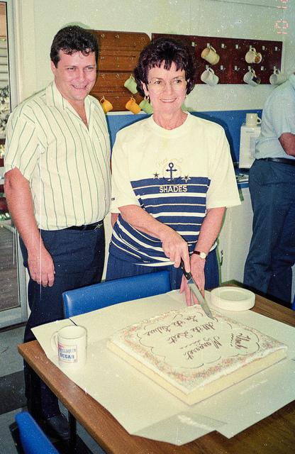
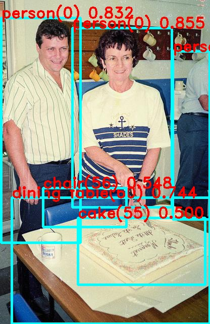

# Milk-V Yolo12 目标检测

## 测试主程序

使用 [v12.cpp](duo/v12.cpp)。

编译方法见 [适用于 V1 版本固件的 TDL-SDK 示例](https://milkv.io/zh/docs/duo/application-development/tdl-sdk/tdl-sdk-introduction#%E9%80%82%E7%94%A8%E4%BA%8E-v1-%E7%89%88%E6%9C%AC%E5%9B%BA%E4%BB%B6%E7%9A%84-tdl-sdk-%E7%A4%BA%E4%BE%8B)。

将源代码替换即可。

## 输出

```
[root@milkv-duo]~# ./sample_yolov8 yolo12n_cv181x_int8_sym.cvimodel duo-tdl-sdk-yolov5-detection.jpg  out.jpg
enter CVI_TDL_Get_YOLO_Preparam...
asign val 0
asign val 1
asign val 2
setup yolov8 param
enter CVI_TDL_Get_YOLO_Preparam...
setup yolov8 algorithm param
yolov8 algorithm parameters setup success!
---------------------openmodel-----------------------
version: 1.4.0
yolo12n Build at 2025-03-01 17:05:41 For platform cv181x
Max SharedMem size:6656000
---------------------to do detection-----------------------
image read,width:416
image read,hidth:640
objnum:6
Detect person(0): 143.069092 55.362289 340.261047 409.857300 0.854953
Detect person(0): 2.953743 35.646866 159.244690 479.729309 0.831542
Detect person(0): 342.131927 101.365387 415.000000 433.155334 0.743529
Detect dining table(60): 23.431549 390.899475 415.000000 639.000000 0.743529
Detect chair(56): 85.551483 371.947754 250.175781 448.465393 0.548328
Detect cake(55): 154.010742 430.204773 406.356934 562.873474 0.500000
```





## 转换命令

```bash
cp -rf ${REGRESSION_PATH}/dataset/COCO2017 .
cp -rf ${REGRESSION_PATH}/image .
```
```bash
model_transform.py \
    --model_name yolo12n \
    --model_def ../yolo12n.onnx \
    --input_shapes [[1,3,640,640]] \
    --mean 0.0,0.0,0.0 \
    --scale 0.0039216,0.0039216,0.0039216 \
    --keep_aspect_ratio \
    --pixel_format rgb \
    --output_names 350,498,646 \
    --test_input ../image/dog.jpg \
    --test_result yolov12n_top_outputs.npz \
    --mlir yolov12n.mlir
```
```bash
run_calibration.py yolov12n.mlir \
--dataset ../COCO2017 \
--input_num 100 \
-o yolo12n_cali_table
```
```bash
model_deploy.py \
--mlir yolov12n.mlir \
--quant_input --quant_output \
--quantize INT8 \
--calibration_table yolo12n_cali_table \
--processor cv181x \
--model yolo12n_cv181x_int8_sym.cvimodel
```